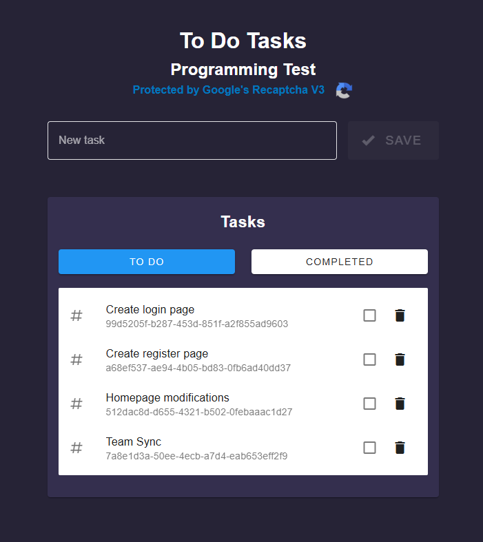

# Todos Task App

Application to manage tasks in an easy and simple way.

## Requirements

- Node version >= v18.16.0
- Docker (optional)

## Run project (Local)

- Clone the project
- cd into folder
- Copy `.env.example` to `.env`
- Set `RECAPTCHA_SITE_KEY` and `RECAPTCHA_SECRET` with your [google recaptcha v3 console keys](https://www.google.com/recaptcha/about/)
- run `npm install`
- run `npm run dev`

## Run project (Docker)

- Clone the project
- cd into folder
- Copy `.env.example` to `.env`
- Set `RECAPTCHA_SITE_KEY` and `RECAPTCHA_SECRET` with your [google recaptcha v3 console keys](https://www.google.com/recaptcha/about/)
- run `docker build -t <image-name> .`
- run `docker run -dp port-you-want:3000 <image-name>`

### Cypress tests

- run `npx cypress open`
- Execute listed tests

### Jest tests

- run `npm test`
